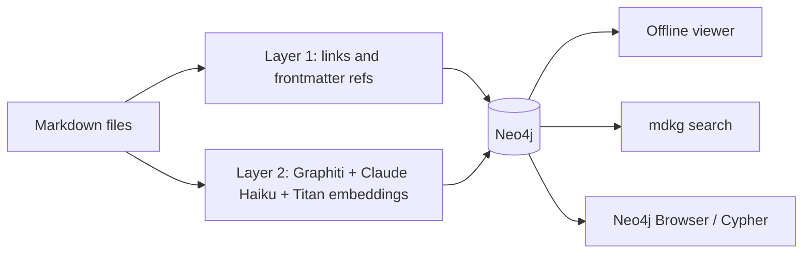

# mdkg: markdown knowledge graph

Turn a folder of markdown files into a knowledge graph you can search and explore.

mdkg reads your notes, pulls out the people, topics and facts in them with an LLM, and stores everything in a local Neo4j database. Then it gives you an interactive viewer that runs offline in your browser.

It is built on [Graphiti](https://github.com/getzep/graphiti) for entity and fact extraction, Amazon Bedrock for the models (Claude Haiku and Titan embeddings), and Neo4j for storage.

## What you get

The graph has two layers:

- **Layer 1, exact links.** Every markdown file becomes a node. Links between files (`[[wiki links]]` and `[markdown](links.md)`) and frontmatter fields that name another file (like `project: apollo`) become edges. This layer uses no LLM, costs nothing, and never leaves your machine.
- **Layer 2, extracted knowledge.** Graphiti reads the text and pulls out entities (people, tools, ideas, projects) and facts between them, like "Maria leads the technical side of Apollo". Each fact keeps a date, and when a later note changes a fact, the old one is marked as no longer true. This layer calls Amazon Bedrock.

The two layers are connected: every file points at the entities it mentions.



## Requirements

- Python 3.12 or 3.13 and [uv](https://docs.astral.sh/uv/)
- Docker, for Neo4j
- An AWS account with Amazon Bedrock access to Claude Haiku 5.5 and Titan Text Embeddings V2

## Quick start

This walks through the example notes in `examples/notes/` (5 small files, a fraction of a cent to index).

```bash
git clone https://github.com/alfonsograziano/markdown-knowledge-graph.git
cd markdown-knowledge-graph
uv sync
cp .env.example .env
```

Open `.env` and fill in your AWS keys, your region and a Neo4j password. Then:

```bash
docker compose up -d          # start Neo4j on localhost
uv run mdkg plan              # see what will be indexed and a rough cost
uv run mdkg structure         # layer 1: links, free and local
uv run mdkg check             # one tiny call to each model, to prove your keys work
uv run mdkg index             # layer 2: asks before it starts, stops at $1 by default
uv run mdkg viz               # open the viewer
```

## Index your own notes

1. Point `SOURCE_DIR` in `.env` at your folder of markdown files.
2. Edit `scope.toml` to choose what gets read. By default it reads every `.md` file in `SOURCE_DIR`, except `.git`, `node_modules` and similar folders. Add anything you do not want to send to the LLM to the `deny` list. Files with `sensitivity: private` in their frontmatter are always skipped.
3. Run `uv run mdkg plan` and check the file list. Nothing is sent anywhere by `plan`.
4. Run `uv run mdkg structure` for layer 1.
5. Run the first load of layer 2 in bulk mode, with a budget:

```bash
uv run mdkg index --batch 15 --max-cost 5
```

6. Run `uv run mdkg viz` to look at the result.

After the first load, run `uv run mdkg structure && uv run mdkg index` whenever your notes change. Only new or changed parts are sent again.

### Getting the most out of your notes

You do not need any special format, but a few habits make the graph better:

- **Link files to each other**, with `[[file-name]]` or normal markdown links. Each link becomes an exact edge.
- **Use frontmatter to name related files**, for example `project: apollo` or `people: [maria, tom]`. A value that matches a file name becomes an edge, and the field name becomes the edge label.
- **Add a `type` field**, like `type: meeting` or `type: person`. The viewer colors and filters files by type.
- **Add dates** (`date`, `created` or `updated`). Graphiti uses them as the time of the facts in that file. Without a date it uses the file's last change time.

## How ingestion works

- **Episodes.** Each file is cut into episodes of at most 1,200 words (change it with `max_words_per_episode` in `scope.toml`). Files are split at `## ` headings first, then at paragraphs. Each episode starts with the file path and title, so the LLM knows where it comes from.
- **Extraction.** For each episode, Graphiti asks the LLM to find entities and facts, matches them against what is already in the graph so the same thing is not added twice, and checks whether new facts contradict old ones.
- **Two speeds.**
  - `index` (one episode at a time) gives the best duplicate matching, because each episode sees everything added before it. Use it for small, regular updates.
  - `index --batch 15` sends batches of episodes through Graphiti's bulk mode. Episodes in a batch are extracted in parallel and merged with each other. In testing it was about 10 times faster and about 3 times cheaper per word, with a slightly higher chance of duplicate entities. Use it for big first loads.
- **Incremental.** `data/index-state.json` keeps a hash of every episode. A re-run only sends episodes that are new or changed. A changed episode is removed from the graph first, then added again.
- **Budget.** Every run stops at `--max-cost` (default $1). `plan` and `index` print a rough cost range before starting. Each run writes a full report with tokens and cost, per Graphiti prompt, to `data/runs/`. See it with `uv run mdkg cost`.

## Explore the graph

### The viewer

`uv run mdkg viz` writes `data/graph.html` and opens it. The page is a single offline file: it makes no network requests.

- **Drawing:** WebGL (sigma.js), so it stays smooth with thousands of nodes. The first open takes a few seconds to lay out. After that, positions are saved and the next open is almost instant.
- **Labels:** they appear only when there is room, and never overlap. Zoom in to see more.
- **Colors:** files are rings colored by `type`. Entities are dots colored by topic cluster (Louvain), and each cluster is named after its biggest entities.
- **Search:** press `/`, type, and pick a result to fly to it. Search is fuzzy.
- **Side panel:** click any node to see:
  - for an entity: its summary, its facts with dates, the files it comes from, and its neighbours;
  - for a file: its links, the entities it mentions, and buttons to copy the path or open the file in VS Code.
- **Filters:** press `[`. Filter by layer, by file type or folder, by minimum number of connections (hide one-off entities), and by fact date.
- **Focus:** select a node and press `1` or `2` to see only its neighbours one or two hops away, and `0` to see everything again.
- **Other:** press `f` to fit the view, `Esc` to clear, and `?` to see all shortcuts. Dark and light mode follow your system.

### Search

```bash
uv run mdkg search "who works on the search project?"
```

`search` returns the facts that best match a question, with their dates. It costs one embedding call.

### Neo4j Browser and Cypher

Open http://localhost:7474 and log in with `neo4j` and the `NEO4J_PASSWORD` from `.env`. Some useful queries:

```cypher
// Entities and the facts between them
MATCH (a:Entity)-[r:RELATES_TO]->(b:Entity) RETURN a, r, b LIMIT 300
```

```cypher
// Everything connected to one entity
MATCH (n:Entity {name: "Hybrid search"})-[r]-(m) RETURN n, r, m
```

```cypher
// Topics that appear in one folder but never in another (here: notes but not meetings)
MATCH (f:Document)-[:HAS_EPISODE]->(:Episodic)-[:MENTIONS]->(n:Entity)
WHERE f.path STARTS WITH 'notes/'
  AND NOT EXISTS {
    MATCH (g:Document)-[:HAS_EPISODE]->(:Episodic)-[:MENTIONS]->(n)
    WHERE g.path STARTS WITH 'meetings/'
  }
RETURN n.name AS topic, collect(DISTINCT f.title) AS files
```

```cypher
// Facts that changed over time
MATCH (a)-[r:RELATES_TO]->(b) WHERE r.invalid_at IS NOT NULL
RETURN r.fact, r.valid_at, r.invalid_at ORDER BY r.invalid_at DESC LIMIT 50
```

The graph model:

| Node or edge | Layer | What it is |
|---|---|---|
| `(:Document)` | 1 | One markdown file: `key`, `path`, `title`, `type`, `status`, `in_scope` |
| `-[:LINKS_TO]->`, `-[:REF {field}]->` | 1 | A link, or a frontmatter reference, between two documents |
| `(:Episodic)` | 2 | One episode, named `<path>#<n>` |
| `(:Entity)` | 2 | A person, tool, idea or anything else Graphiti found: `name`, `summary` |
| `-[:RELATES_TO {fact, valid_at, invalid_at}]->` | 2 | A fact between two entities |
| `(:Episodic)-[:MENTIONS]->(:Entity)` | 2 | An episode mentions an entity |
| `(:Document)-[:HAS_EPISODE]->(:Episodic)` | both | Connects a file to its episodes |

## Commands

Run each one with `uv run mdkg <command>`.

| Command | What it does | Calls AWS? |
|---|---|---|
| `plan` | Lists the files and episodes in scope, with a rough cost range | No |
| `structure` | Writes layer 1 into Neo4j. `--dry-run` only prints it | No |
| `check` | One tiny call to the LLM and one to the embedding model | Yes, a fraction of a cent |
| `index` | Runs layer 2 on new or changed episodes. Asks first. `--max-cost` sets the budget (default $1), `--limit N` runs only N episodes, `--batch N` uses bulk mode, `--yes` skips the question | Yes |
| `search "question"` | Returns the facts that best match the question | Yes, one embedding |
| `status` | Counts what is in Neo4j | No |
| `cost` | The cost report of the last `index` run, per Graphiti prompt | No |
| `viz` | Writes `data/graph.html` and opens it. `--no-open` only writes it | No |

## What it costs

In testing, on a few hundred thousand words of technical notes:

- Bulk mode (`--batch 15`) cost about **$0.01 per 1,000 words** and processed about 10,000 words a minute.
- One at a time cost about $0.03 per 1,000 words and processed about 1,200 words a minute.
- Cost per episode grows as the graph grows, because Graphiti checks every new fact against the facts already there. The biggest cost line is usually `dedupe_edges.resolve_edge`.

Your numbers depend on your text and your region's prices. Set the prices in `.env` so the reports are right, and start with a small folder.

## Privacy

What leaves your machine:

- **Amazon Bedrock** receives the text of every episode you index and every search question. `scope.toml` controls what is read.
- **Nothing else.**
  - Graphiti's telemetry is turned off (`GRAPHITI_TELEMETRY_ENABLED=false`).
  - Neo4j's usage reporting is turned off in `docker-compose.yml`.
  - Neo4j only listens on `127.0.0.1`.
  - The viewer is one offline file with its libraries inlined.
  - Layer 1 is fully local.

`.env` and `data/` are gitignored.

## Configuration

All settings live in `.env` (see `.env.example`):

| Variable | Default | What it does |
|---|---|---|
| `SOURCE_DIR` | `examples/notes` | The folder of markdown files to index |
| `AWS_ACCESS_KEY_ID`, `AWS_SECRET_ACCESS_KEY`, `AWS_SESSION_TOKEN`, `AWS_REGION` | none | AWS credentials. The keys in `.env` are always used, never the profiles in `~/.aws` |
| `LLM_MODEL` | `anthropic.claude-haiku-5-5` | The Bedrock model or inference profile id |
| `EMBEDDING_MODEL`, `EMBEDDING_DIM` | `amazon.titan-embed-text-v2:0`, `1024` | The embedding model and its size |
| `PRICE_*_PER_MTOK` | Haiku 5.5 and Titan V2 list prices | Used only for the cost reports |
| `NEO4J_URI`, `NEO4J_USER`, `NEO4J_PASSWORD` | `bolt://localhost:7687`, `neo4j` | The Neo4j connection |
| `GROUP_ID` | `default` | A name for this graph. Use one per corpus to keep several graphs in one database |
| `SEMAPHORE_LIMIT` | `12` | How many LLM calls Graphiti runs in parallel |

## Gotchas

- **Use an inference profile id if the plain model id fails.** In many regions, Claude Haiku 5.5 is only offered on demand through an inference profile. If `check` says the model does not exist, or that on-demand throughput is not supported, set `LLM_MODEL` to the profile for your region, like `eu.anthropic.claude-haiku-5-5` or `us.anthropic.claude-haiku-5-5`. `aws bedrock list-inference-profiles` lists them.
- **The classic Bedrock client is used.** The newer Bedrock "Mantle" endpoint did not serve Haiku 5.5 in every region during testing, so `mdkg` uses `AsyncAnthropicBedrock`.
- **`temperature` is stripped.** The Anthropic SDK 1.x removed `temperature` from `messages.create()`, but graphiti-core 0.30.2 still sends it. A small wrapper in `mdkg/clients.py` drops it.
- **No reranker.** Graphiti only uses a reranker in advanced search recipes, never while indexing. If you don't pass one, it quietly creates an OpenAI reranker. A pass-through reranker is passed instead.
- **`httpx` is listed in `pyproject.toml`**, because graphiti-core imports it but does not declare it.
- **Index-creation errors at startup are harmless.** Graphiti creates its Neo4j indexes in parallel, and Neo4j may report that one already exists. mdkg hides that message.

## Project layout

```
mdkg/
  cli.py          the commands
  config.py       settings from .env
  scope.py        which files are read, and how they are cut into episodes
  structure.py    layer 1: links and frontmatter refs
  clients.py      Bedrock LLM and embedder, the pass-through reranker
  index.py        layer 2: Graphiti, budgets and cost reports
  viz.py          builds data/graph.html
  static/         the viewer (viewer.html, viewer.js) and its libraries
examples/notes/   five example notes to try it on
scope.toml        what gets read
docker-compose.yml
```

The viewer libraries are the published npm builds of [sigma.js](https://www.sigmajs.org/) 3.0.3, [graphology](https://graphology.github.io/) 0.26.0 and graphology-library 0.8.0, all MIT licensed.
